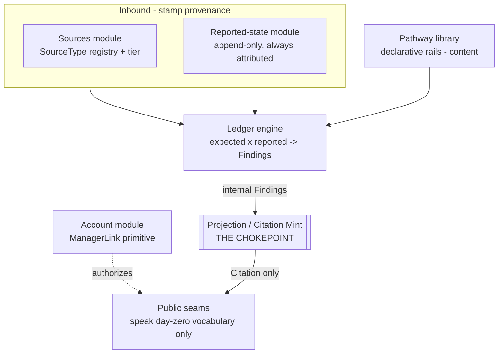

# Responsible Doctor — MVP Architecture (Pillar 1)

A proactive care-coordinator that **steers** medical processes and **never originates advice**.
Its single unifying object is the personal **medical tracking file** (*תיק מעקב רפואי*): a fusion of
authoritative sources with the subject's own reported state, projected into an **expected-vs-done ledger**.

This document specifies the shape only. No running code is required.

## 0. The one idea the whole architecture is built to protect

> **Every output the system emits is a `Citation` = (an authoritative `Source`) × (a `ReportedState`).
> The system never infers the medical state, and never originates advice.**

Everything below exists to make that sentence *true by construction* rather than *true by discipline*.
The design's spine is a single, narrow chokepoint — the **Projection** — that is the only component in
the system able to produce a value the outside world can see, and it can only ever produce a `Citation`.

**Design assumptions** (stated inline where relevant, collected here):

- Single logical service with a relational store is sufficient for the MVP; horizontal scale is out of scope.
- "Authoritative" is a property the ingest layer stamps, not something the system reasons its way to.
- Pathways are *data* (declarative rails), not code; publishing one is a content operation.
- All reported state is subject-supplied or source-supplied and taken at face value — no derivation.
- One human language surface (Hebrew/English) at a time; localization of the constant table is out of scope.

---

## 1. Data model

The model is deliberately small. Five nouns carry the whole product; a sixth (`Citation`) is *derived only*
and is never stored as an authored fact.

### 1.1 Account / identity

| Entity | Fields (essential) | Notes |
|---|---|---|
| `Person` | `person_id`, `display_name`, `dob?`, `sex?`, `risk_flags[]` | A human. `risk_flags`/`dob`/`sex` are *reported cohort facts*, never inferred. |
| `ManagerLink` | `link_id`, `manager_person_id`, `subject_person_id`, `role`, `scope[]`, `granted_at`, `revoked_at?` | **The account primitive** (§4). One row = one manager's authority over one subject. |

There is no separate "family account" or "doctor account" type — see §4.

### 1.2 Sources (the authoritative half of every citation)

| Entity | Fields | Notes |
|---|---|---|
| `SourceType` | `source_type_id`, `name`, `class`, `confidence_tier`, `owner` | Registry row. `class ∈ {GUIDELINE, DOCTOR_INSTRUCTION, PRESCRIPTION, RESULT}`. Adding a class = one registry change (§ exit 5). |
| `Source` | `source_id`, `source_type_id`, `subject_person_id?`, `issued_by`, `issued_at`, `authority_ref`, `payload`, `quoted_text` | A concrete authoritative artifact. `quoted_text` is the source's own words — the system may echo it but never rewrite it. `subject_person_id` null ⇒ population-level (a guideline); set ⇒ subject-specific (an instruction/prescription/result). |

`confidence_tier` lives on `SourceType`, so **the tier is a property of provenance** and travels
automatically with anything that references a source (§ exit 4). Tier ladder (highest first):

| Tier | Meaning | Typical `class` |
|---|---|---|
| **T1 — Directive** | Issued *to this subject* by a treating clinician. | `DOCTOR_INSTRUCTION`, `PRESCRIPTION` |
| **T2 — Guideline** | Authoritative population protocol, applied by cohort. | `GUIDELINE` (screening/well-baby schedule) |
| **T3 — Reported result** | A recorded measurement/result the subject or source supplied. | `RESULT` |

### 1.3 Pathway library (the *expected* rails — declarative, not enumerated)

| Entity | Fields | Notes |
|---|---|---|
| `Pathway` | `pathway_id`, `title`, `version`, `backing_source_type_id`, `status` | A named rail set (e.g. "Adult screening", "Well-baby 0–2y"). Backed by a `GUIDELINE` source type so every step it emits already has a source + tier. |
| `RailStep` | `step_id`, `pathway_id`, `applies_when`, `cadence`, `expects`, `satisfied_by`, `open_process_key?` | The declarative unit. |

`RailStep` fields are **predicates and selectors over reported facts — never free-text advice**:

- `applies_when` — a cohort predicate over `Person` reported facts (`age_between`, `sex_is`, `has_risk_flag`).
- `cadence` — when/how often the step is expected (`once`, `every(interval)`, `by_age(x)`).
- `expects` — the reported item shape that would count as this step being *done* (a `ReportedItem.kind`).
- `satisfied_by` — the match rule joining `expects` to a real `ReportedItem` (§5).
- `open_process_key` — if set, marks the step as belonging to an *open process* that, when unplanned, yields a **Referral** rather than a due item (§5.3).

A pathway is pure data. **Adding a pathway = inserting rows here. It touches nothing else** (§ exit 5).

### 1.4 Reported state (the *reported/done* half — face value, never inferred)

| Entity | Fields | Notes |
|---|---|---|
| `ReportedItem` | `item_id`, `subject_person_id`, `kind`, `value`, `source_id`, `reported_at`, `effective_at` | Append-only. Every reported item **must** carry a `source_id` — nothing enters state unattributed. `kind ∈ {RESULT, INSTRUCTION_RECORDED, PRESCRIPTION_RECORDED, EVENT_DONE, OPEN_PROCESS}`. |

`ReportedItem` is the entire "state." The system reads it; it never writes derived state back.

### 1.5 The output object — `Citation` (derived, never authored)

`Citation` is not a table. It is the **only** value the Projection may return, and it is structurally a join:

```
Citation {
  relation   : DUE | DONE | GAP | REFERRAL     # closed enum — no "RECOMMEND"
  source_ref : SourceRef        # → a real Source (+ its confidence_tier), required
  reported_ref : ReportedRef?   # → a real ReportedItem or the OPEN_PROCESS it concerns
  subject_ref : SubjectRef      # whose file this is
  as_of      : timestamp
}
```

There is **no free-text field the system fills**. Human-readable output is composed from exactly two
places: (a) the source's own `quoted_text`, and (b) the subject's own reported `value`. The system's own
words come only from a small, audited **constant table keyed by `relation`** (e.g. `DUE → "expected now"`,
`REFERRAL → "ask your doctor about this"`). Those constants are generic and carry no clinical content —
they cannot name a drug, a dose, or a course of action. This is what makes "never originates advice"
a *type-level* fact, not a review checklist.

---

## 2. Module / boundary structure

Seven modules, each with a single owner. The dependency arrows point **inward toward the Projection**;
nothing routes around it.



| Module | Owns | Why it is isolated |
|---|---|---|
| **Account** | `Person`, `ManagerLink`, authorization scope | The account primitive lives in exactly one place (§4). |
| **Sources** | `SourceType` registry, `Source` ingest, tier assignment | New source *type* = one change here (§ exit 5). |
| **Pathway library** | `Pathway`, `RailStep` | New pathway = one content change here (§ exit 5). |
| **Reported-state** | `ReportedItem` (append-only, attributed) | Guarantees no state exists without a source. |
| **Ledger engine** | pure join `expected × reported → Finding[]` | Computes gaps; produces **internal Findings, never outputs** (§5). |
| **Projection / Citation Mint** | the `Citation` type + relation enum + constant table | **The chokepoint** — see §3. |
| **Public seams** | request/response in day-zero vocabulary | Can only surface Citations the Mint produced. |

Crucial boundary rule: **the Ledger engine's `Finding` is an internal type and is not serializable to a
client.** The only type that crosses the public seam is `Citation`, and the only producer of `Citation`
is the Mint. The Ledger can *compute* a gap; it cannot *emit* one.

---

## 3. Ownership of the citation invariant (the chokepoint)

The invariant is **owned by one module: the Projection / Citation Mint.** Its contract:

1. **Sole constructor.** `Citation` has no public constructor. The only way to obtain one is
   `Mint.project(Finding) -> Citation`. Language-level visibility (package-private constructor / sealed
   type) enforces this; no other module can fabricate a `Citation`.

2. **Refuses to originate.** `Mint.project` requires a resolvable `SourceRef` for every citation.
   - `DUE`/`DONE`/`GAP` require **both** a `SourceRef` (the rail's backing guideline, or the instruction/
     prescription) **and** a `ReportedRef`. A finding missing either is rejected — it cannot become output.
   - `REFERRAL` requires a `ReportedRef` to the `OPEN_PROCESS` item and resolves its source to the single
     fixed **boundary constant** `ASK_DOCTOR`. That constant is the *only* content the system authors, it
     is audited once, and it says nothing but "ask your doctor" (§5.3). It cannot name an action.

3. **Closed vocabulary.** `relation` is a sealed enum with no `RECOMMEND`/`ADVISE`/`SUGGEST` member and no
   escape hatch to free text. Rendering pulls only `Source.quoted_text` + `ReportedItem.value` + the
   `relation` constant. There is no code path from any module to a client-visible string that bypasses this.

4. **Provenance is inseparable.** Because a `Citation` *is* `(source_ref × reported_ref)`, the source and
   its `confidence_tier` are not decorations that could be dropped — remove them and there is no citation
   left to emit (§ exit 4).

This satisfies exit criterion 1: **one place every output must pass through that can only emit a
`(source × reported-state)` citation, with no path to originate advice or infer state.**

---

## 4. The `manager → subject(s)` account primitive

There is exactly **one** relationship type: `ManagerLink(manager, subject, role, scope)`.

- A person **managing their own file** is `ManagerLink(self, self)` — the same row shape.
- A person **managing their family** has N links: `(mom → child1), (mom → child2), (mom → mom)`.
- A **doctor managing patients** has M links: `(doc → patientA), (doc → patientB) …`.

Family and clinical panels are **the same abstraction at different fan-out** — never a special case
(§ exit 2). `role` (`SELF | FAMILY | CLINICIAN`) and `scope[]` tune *permissions and which SourceTypes the
manager may ingest* (e.g. only a `CLINICIAN` link may attach a `DOCTOR_INSTRUCTION` source); they do **not**
create a second entity or a second code path.

Authorization is uniform: **every read and every write is evaluated against a `ManagerLink` between the
acting manager and the target subject.** The Projection is subject-scoped — a `Citation` is always about one
subject's file — so multi-subject is just iteration over links, not a distinct feature.

The doctor is not privileged past the boundary: **a doctor user's outputs are still Citations.** The system
never lets a clinician-manager turn the app into an advice generator — the doctor authors `Source`s
(instructions/prescriptions), which then flow through the same Mint as everyone else's.

---

## 5. Expected-vs-done ledger

`Expected` and `Reported` are **distinct data with distinct owners**, joined by a pure function. Gaps are
*computed*, never enumerated per example (§ exit 3).

### 5.1 Materializing the *expected* side (rails → expected items)

For a subject, the Ledger engine evaluates the pathway library:

```
for each Pathway applicable to subject:
  for each RailStep where applies_when(subject.reported_cohort_facts) is true:
     ExpectedItem = { step, backing_source (=> tier), due_window(cadence, subject) }
```

`ExpectedItem` is thus born already carrying its `Source` and `confidence_tier` — provenance is present
before any join happens. Applicability uses only **reported** cohort facts (`dob`, `sex`, `risk_flags`);
the engine never infers a cohort.

### 5.2 The join (expected × reported → Finding)

```
for each ExpectedItem E:
   matches = ReportedItems where satisfied_by(E.step, item)
   if matches non-empty:            Finding(DONE,  source=E.source, reported=latest(matches))
   else if E.due_window is open:    Finding(DUE,   source=E.source, reported=none)     # a GAP
   else:                            (not yet due — no finding)
```

- **DONE** = expected step has a matching reported item.
- **GAP / DUE** = expected step is due and has no matching reported item → a flagged gap.
- Each `Finding` carries the backing source and its tier, so the eventual `Citation` is inseparable from
  its provenance and confidence (§ exit 4).

The join is one function over `(RailStep.satisfied_by, ReportedItem)`. Adding a pathway or a source type
adds rows the join already knows how to consume — the join code does not change (§ exit 5).

### 5.3 The "open process with no plan" → nudge (Referral)

An `OPEN_PROCESS` reported item (e.g. "referred to cardiology", "abnormal result flagged") represents a
live process. The engine checks whether **any** applicable `RailStep` with a matching `open_process_key`
covers it:

- **Covered** → normal DUE/DONE findings apply.
- **Not covered** (no rail plans this open process) → `Finding(REFERRAL, reported=the OPEN_PROCESS)`.

The Mint turns this into a `Citation(relation=REFERRAL, source=ASK_DOCTOR, reported=open_process)` — a
structural nudge to **ask the doctor**. The system states *that* a planned next step is missing; it never
states *what* the step should be. This is the non-advice boundary doing exactly its job.

### 5.4 The ledger output

`Ledger(subject) = Mint.project(Finding)[]` — a list of Citations of relation `DUE | DONE | GAP | REFERRAL`,
each with source + tier + reported ref. That list *is* the projected tracking file for Pillar 1.

---

## 6. Day-zero vocabulary (what the public seams may speak)

The closed vocabulary the API and any client may use. Nothing outside this list crosses the seam.

**Nouns**

| Term | Meaning |
|---|---|
| `Manager` | An acting person operating one-or-many subjects. |
| `Subject` | The person whose tracking file is in view. |
| `ManagerLink` | The `manager → subject` authority (`role`, `scope`). |
| `Source` | An authoritative artifact (`class`, `confidence_tier`, `quoted_text`). |
| `ConfidenceTier` | `T1_DIRECTIVE | T2_GUIDELINE | T3_RESULT`. |
| `ReportedItem` | A subject/source-supplied fact (always attributed). |
| `Pathway` / `RailStep` | A declarative expected rail and its steps. |
| `ExpectedItem` | A rail step materialized for a subject (carries source + tier). |
| `Citation` | The only output: `(source × reported-state, relation)`. |
| `Relation` | `DUE | DONE | GAP | REFERRAL` (closed; no advice member). |
| `Ledger` | The subject's Citation list — the expected-vs-done file. |

**Verbs (operations)** — all subject-scoped through a `ManagerLink`:

| Operation | Effect | Returns |
|---|---|---|
| `linkSubject(manager, subject, role, scope)` | Create/revoke a `ManagerLink`. | `ManagerLink` |
| `ingestSource(subject, source)` | Attach an authoritative source. | `Source` |
| `reportItem(subject, reportedItem)` | Append attributed reported state. | `ReportedItem` |
| `publishPathway(pathway, railSteps)` | Add/version a rail (content op). | `Pathway` |
| `getLedger(subject, asOf?)` | Project expected-vs-done. | `Citation[]` (only) |

`getLedger` is the sole read that reaches state, and it returns **only** `Citation[]`. There is no endpoint
that returns advice, a recommendation, or an inferred state, because no such type exists to return.

---

## 7. Explicitly out of the MVP

Anything below is **speculative** relative to this brief and is intentionally excluded:

- **The integrated overview (*המכלול* / Pillar 2+)** — cross-process synthesis, dashboards, prioritization.
- **Any inference of medical state** — suspicions, risk scoring, differential reasoning, "the system thinks…".
  The architecture has no writer of derived state and no such type.
- **Any advice origination** — recommending drugs, doses, procedures, or courses of action; there is no
  `RECOMMEND` relation and no free-text output field.
- **Source reconciliation / de-duplication / conflict resolution** across overlapping sources beyond the
  simple `satisfied_by` match — a single-source-of-truth-per-step model is assumed.
- **Real EHR / lab / pharmacy integrations** — ingest adapters are assumed to hand the Sources module
  already-stamped authoritative artifacts; building those adapters is out of scope.
- **Notification / scheduling / messaging infrastructure** — "nudge" here is a Citation of relation
  `REFERRAL`, not a delivery channel.
- **Localization** of the constant table beyond one language surface.
- **Analytics across subjects** for a manager (population views for a doctor) — each subject's file is
  projected independently.
- **New source classes or pathway domains** not needed by the MVP sources (one guideline schedule + the
  subject's reported results/instructions/prescriptions). The *mechanism* to add them exists (§ exit 5); no
  such content is pre-built.

---

## 8. How the design meets each exit criterion

| # | Criterion | Where satisfied |
|---|---|---|
| 1 | Non-advice boundary enforced by architecture | §3 — the Mint is the sole `Citation` constructor; closed relation enum; no free-text field. |
| 2 | `manager → subject(s)` a single primitive | §4 — one `ManagerLink` row shape; family/clinician are fan-out, not special cases. |
| 3 | Expected & reported distinct; gaps joined | §1.3/§1.4 distinct owners; §5.2 a single pure join computes gaps. |
| 4 | Provenance + tier travel with every item | §1.2 tier on `SourceType`; §1.5 a `Citation` *is* the source join — provenance is inseparable. |
| 5 | New pathway / source type = one owner's change | §1.3 pathway = library rows; §1.2 source type = registry row; join & Mint untouched. |
| 6 | Scoped to Pillar 1 + MVP sources | §7 — overview, inference, and unstated sources explicitly excluded. |
